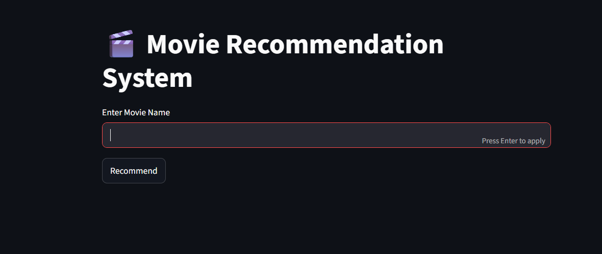
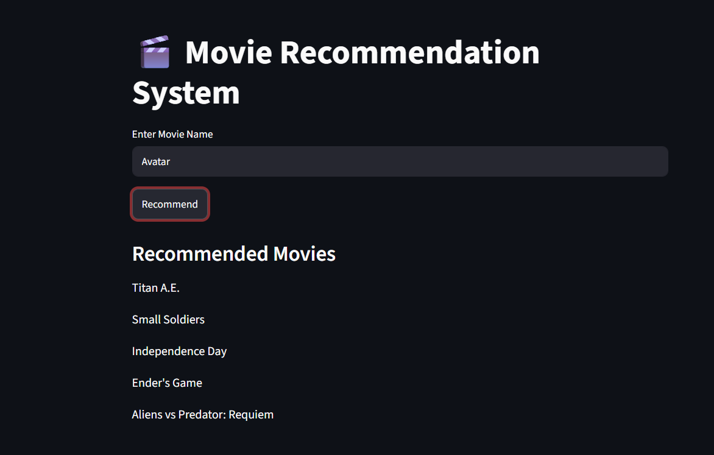
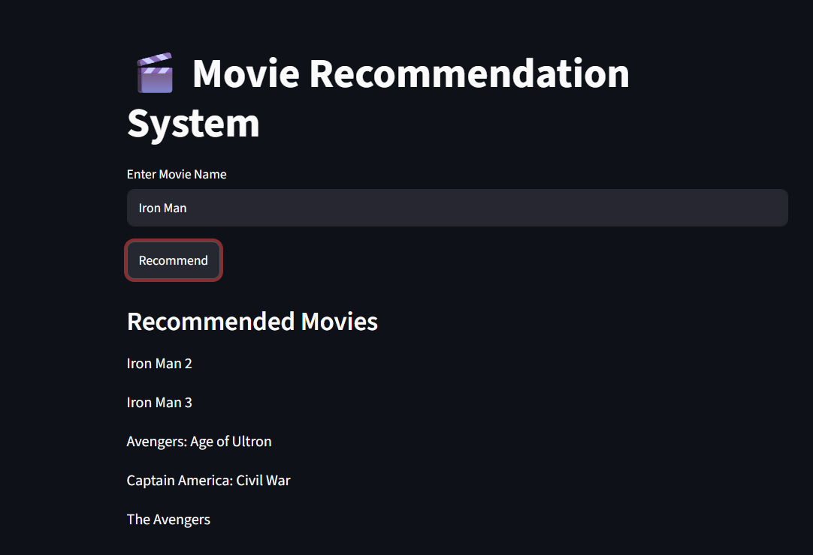

# 🎬 Movie Recommendation System

## Overview

A Content-Based Movie Recommendation System built using Python, Pandas, Scikit-Learn, and Streamlit. The system recommends movies similar to the user's input by analyzing movie metadata such as genres, keywords, cast, and crew.

## Features

* Recommend similar movies based on user input
* Content-based filtering using movie metadata
* Interactive Streamlit web interface
* Uses TMDB 5000 Movies Dataset
* Fast movie similarity search using Cosine Similarity

## Technologies Used

* Python
* Pandas
* Scikit-Learn
* Streamlit
* CountVectorizer
* Cosine Similarity

## Screenshots

### Home Page



### Avatar Recommendation



### Iron Man Recommendation



## Example

**Input:**

Avatar

**Output:**

* Titan A.E.
* Small Soldiers
* Independence Day
* Ender's Game
* Aliens vs Predator: Requiem

## Dataset

The project uses the TMDB 5000 Movies Dataset:

* tmdb_5000_movies.csv
* tmdb_5000_credits.csv

## How to Run

```bash
pip install pandas scikit-learn streamlit
streamlit run app.py
```

## Author

Sanjay S
